# Otus Highload Social Network

## Требования

- JDK 25
- Docker

## Сборка и запуск

### Через Docker Compose 

```bash
# 1. Собрать и запустить все сервисы (PostgreSQL, приложение, мониторинг)
docker compose up --build -d

# 2. (опционально) Посмотреть логи приложения
docker compose logs -f app

# 3. Остановить
docker compose down
```

### Локальная разработка (приложение вне Docker)

```bash
# 1. Собрать проект
./gradlew build

# 2. Запустить PostgreSQL
docker compose up -d postgres

# 3. Запустить приложение
./gradlew bootRun
```

Приложение будет доступно на `http://localhost:8080`.

## API

| Метод | Путь | Auth | Описание |
|---|---|---|---|
| POST | `/login` | нет | Аутентификация: `{"id": "uuid", "password": "..."}` → `{"token": "uuid"}` |
| POST | `/user/register` | нет | Регистрация: `{"first_name": "...", "second_name": "...", "birthdate": "2000-01-01", "gender": "MALE", "interests": "...", "city": "...", "password": "..."}` → `{"user_id": "uuid"}` |
| POST | `/user/get/{id}` | да (Bearer token) | Получение анкеты |
| GET | `/user/search?first_name=...&last_name=...` | да (Bearer token) | Поиск анкет |

---

# ДЗ: Производительность индексов

## Методика

- **Данные**: 998 949 анкет (~1M), загрузка через нативный `COPY` (Liquibase customChange, ~5 секунд).
- **Нагрузка**: Apache JMeter, 20 секунд на уровень, одновременные запросы c = 1 / 10 / 100 / 1000.
- **Метрики**: Grafana + Prometheus, `http_server_requests_seconds{uri=~"/user/search.*"}`, percentile-histogram включён.
- **Стенд**: PostgreSQL 16 (Docker), Spring Boot 4.1, 10 ядер, Docker Desktop VM 12 GB.
- **Запрос приложения** (`UserRepository.search`): префиксный поиск с капитализацией, `ORDER BY id LIMIT 50`:
  ```sql
  SELECT id, first_name, second_name, birthdate, gender, interests, biography, city, password_hash
  FROM users
  WHERE first_name LIKE :firstName AND second_name LIKE :secondName
  ORDER BY id
  LIMIT :limit
  ```

## До индекса: latency


*Latency: 1 одновременный запрос, 20 секунд — до индекса*

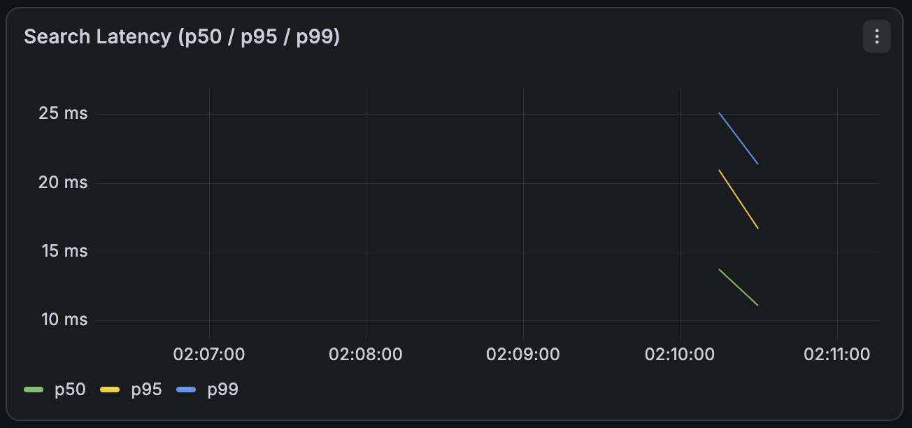

*Latency: 10 одновременных запросов, 20 секунд — до индекса*

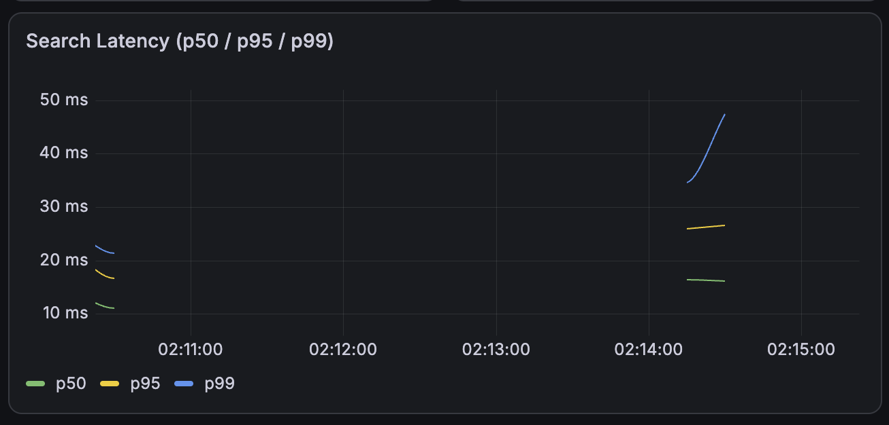

*Latency: 100 одновременных запросов, 20 секунд — до индекса*

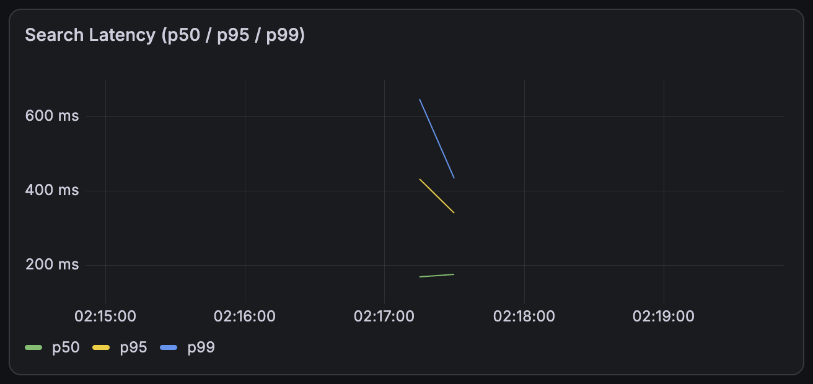

*Latency: 1000 одновременных запросов, 20 секунд — до индекса*

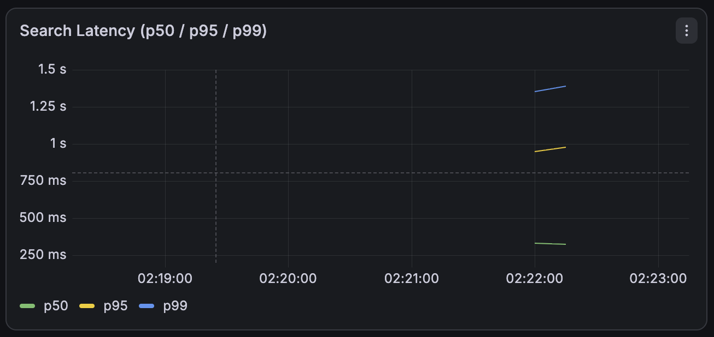

## До индекса: throughput

*Throughput: 1 одновременный запрос, 20 секунд — до индекса*

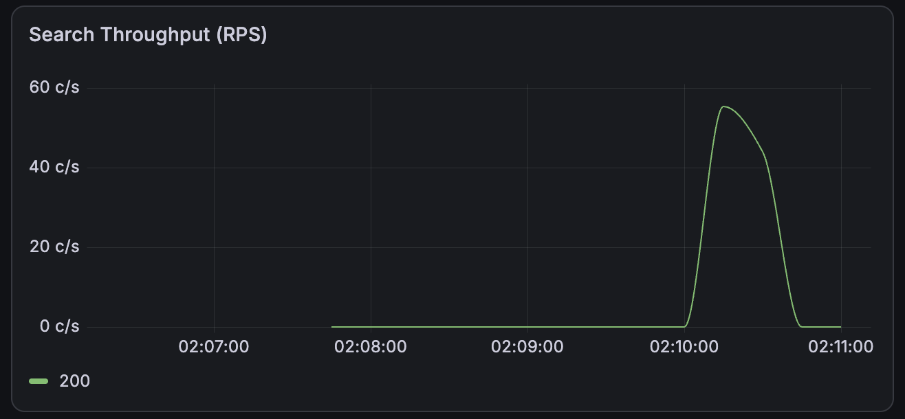

*Throughput: 10 одновременных запросов, 20 секунд — до индекса*

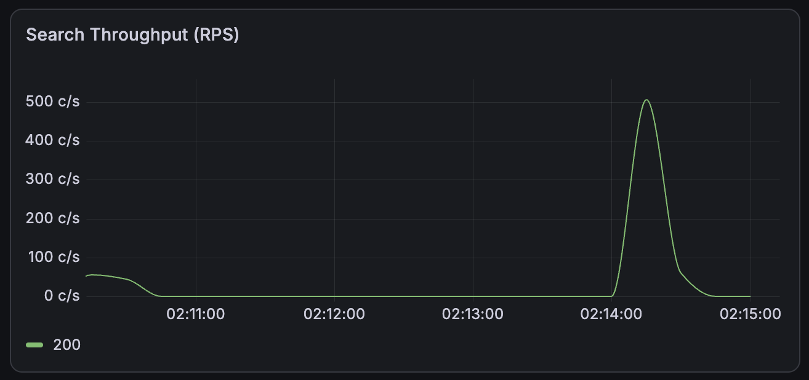

*Throughput: 100 одновременных запросов, 20 секунд — до индекса*

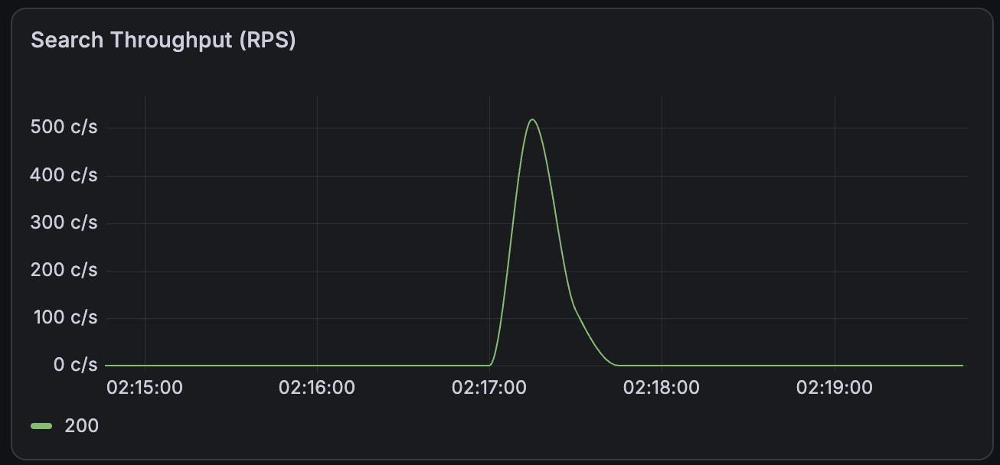

*Throughput: 1000 одновременных запросов, 20 секунд — до индекса*

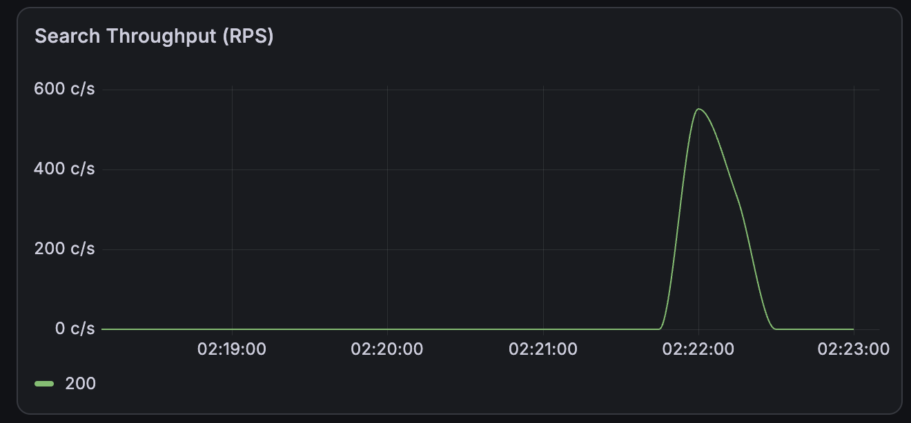

## Проблема: план запроса до индекса

Поиск вырождался в полное сканирование таблицы через первичный ключ: индекс по PK отдаёт все строки подряд, а предикаты `LIKE` применяются фильтром к каждой строке — **40 109 строк отфильтрованы, запрос выполнялся ~203 мс**:

```
Limit  (cost=0.42..6213.42 rows=50 width=198) (actual time=10.215..202.560 rows=50 loops=1)
  ->  Index Scan using users_pkey on users  (cost=0.42..126621.31 rows=1019 width=198) (actual time=10.214..202.543 rows=50 loops=1)
        Filter: (((first_name)::text ~~ 'Алекс%'::text) AND ((second_name)::text ~~ 'Смирн%'::text))
        Rows Removed by Filter: 40109
Planning Time: 0.204 ms
Execution Time: 202.592 ms
```

При 10 соединениях Hikari потолок пула: `10 соединений × (1000 / 203 мс) ≈ 49 запросов/с` — и на нагрузке упиралось в ~500–550 rps на 100/1000 одновременных запросов.

## Запрос добавления индекса

`app/src/main/resources/db/changelog/changesets/004_create_search_index.xml`:

```sql
CREATE INDEX users_search_idx ON users (second_name COLLATE "C", first_name COLLATE "C");
```

## EXPLAIN после индекса

Итоговый индекс `users_search_idx` — btree `(second_name COLLATE "C", first_name COLLATE "C")`:

```
Limit  (cost=2232.23..2232.36 rows=50 width=198) (actual time=2.572..2.589 rows=50 loops=1)
  ->  Sort  (cost=2232.23..2234.87 rows=1054 width=198) (actual time=2.571..2.578 rows=50 loops=1)
        Sort Key: id
        Sort Method: top-N heapsort  Memory: 46kB
        ->  Index Scan using users_search_idx on users  (cost=0.42..2197.22 rows=1054 width=198)
              (actual time=0.041..1.986 rows=1001 loops=1)
              Index Cond: (((second_name)::text >= 'Смирн'::text)
                        AND ((second_name)::text < 'Смиро'::text)
                        AND ((first_name)::text >= 'Алекс'::text)
                        AND ((first_name)::text < 'Алект'::text))
              Filter: (((first_name)::text ~~ 'Алекс%'::text)
                    AND ((second_name)::text ~~ 'Смирн%'::text))
Planning Time: 0.419 ms
Execution Time: 2.626 ms
```

Планер превратил `LIKE 'Смирн%'` в range-кондицию `>= 'Смирн' AND < 'Смиро'` и по индексу прочитал ровно **1 001 подходящую строку** вместо 40 109 строк с фильтром. Исполнение: **2.6 мс** против **202.6 мс** (×78).

## Перепроверка на живой таблице (шаги бенчмарка)

Все запросы выполнены на живой таблице `users` (~999k строк), запрос приложения как в проде. После каждого шага индекс удалялся и создавался следующий кандидат.

#### Шаг 1. Без индекса (baseline)

```
Limit  (cost=0.42..6213.42 rows=50 width=198) (actual time=10.215..202.560 rows=50 loops=1)
  ->  Index Scan using users_pkey on users  (cost=0.42..126621.31 rows=1019 width=198) (actual time=10.214..202.543 rows=50 loops=1)
        Filter: (((first_name)::text ~~ 'Алекс%'::text) AND ((second_name)::text ~~ 'Смирн%'::text))
        Rows Removed by Filter: 40109
Planning Time: 0.204 ms
Execution Time: 202.592 ms
```

#### Шаг 2. Кандидат A: plain btree `(second_name, first_name)` — индекс НЕ использован

```sql
CREATE INDEX users_search_idx ON users (second_name, first_name);
```

```
Limit  (cost=0.42..6574.57 rows=50 width=198) (actual time=14.633..119.829 rows=50 loops=1)
  ->  Index Scan using users_pkey on users  (cost=0.42..126618.45 rows=963 width=198) (actual time=14.632..119.815 rows=50 loops=1)
        Filter: (((first_name)::text ~~ 'Алекс%'::text) AND ((second_name)::text ~~ 'Смирн%'::text))
        Rows Removed by Filter: 40109
Planning Time: 0.334 ms
Execution Time: 119.867 ms
```

План не изменился — планер игнорирует plain btree для `LIKE`.

#### Шаг 3. Кандидат B: btree `COLLATE "C"` — итоговый

```sql
CREATE INDEX users_search_idx ON users (second_name COLLATE "C", first_name COLLATE "C");
```

```
Limit  (cost=2232.23..2232.36 rows=50 width=198) (actual time=2.572..2.589 rows=50 loops=1)
  ->  Sort  (cost=2232.23..2234.87 rows=1054 width=198) (actual time=2.571..2.578 rows=50 loops=1)
        Sort Key: id
        Sort Method: top-N heapsort  Memory: 46kB
        ->  Index Scan using users_search_idx on users  (cost=0.42..2197.22 rows=1054 width=198)
              (actual time=0.041..1.986 rows=1001 loops=1)
              Index Cond: (((second_name)::text >= 'Смирн'::text)
                        AND ((second_name)::text < 'Смиро'::text)
                        AND ((first_name)::text >= 'Алекс'::text)
                        AND ((first_name)::text < 'Алект'::text))
              Filter: (((first_name)::text ~~ 'Алекс%'::text)
                    AND ((second_name)::text ~~ 'Смирн%'::text))
Planning Time: 0.419 ms
Execution Time: 2.626 ms
```

#### Шаг 4. Кандидат C: btree `text_pattern_ops`

```sql
CREATE INDEX users_search_idx ON users (second_name text_pattern_ops, first_name text_pattern_ops);
```

```
Limit  (cost=3243.33..3243.45 rows=50 width=198) (actual time=3.535..3.544 rows=50 loops=1)
  ->  Sort  (cost=3243.33..3245.60 rows=911 width=198) (actual time=3.534..3.537 rows=50 loops=1)
        Sort Key: id
        Sort Method: top-N heapsort  Memory: 45kB
        ->  Bitmap Heap Scan on users  (cost=170.01..3213.06 rows=911 width=198) (actual time=2.206..3.287 rows=1001 loops=1)
              Recheck Cond: (((second_name)::text ~~ 'Смирн%'::text) AND ((first_name)::text ~~ 'Алекс%'::text))
              Heap Blocks: exact=335
              ->  Bitmap Index Scan on users_search_idx  (cost=0.00..169.78 rows=911 width=0) (actual time=2.153..2.153 rows=1001 loops=1)
                    Index Cond: (((second_name)::text ~~ 'Смирн%'::text) AND ((first_name)::text ~~ 'Алекс%'::text))
Planning Time: 0.231 ms
Execution Time: 3.596 ms
```

#### Шаг 5. Кандидат D: GIN `pg_trgm`

```sql
CREATE EXTENSION IF NOT EXISTS pg_trgm;
CREATE INDEX users_search_idx ON users USING gin (second_name gin_trgm_ops, first_name gin_trgm_ops);
```

```
Limit  (cost=3243.33..3243.45 rows=50 width=198) (actual time=2.941..2.952 rows=50 loops=1)
  ->  Sort  (cost=3243.33..3245.60 rows=911 width=198) (actual time=2.940..2.944 rows=50 loops=1)
        Sort Key: id
        Sort Method: top-N heapsort  Memory: 45kB
        ->  Bitmap Heap Scan on users  (cost=170.01..3213.06 rows=911 width=198) (actual time=1.953..2.750 rows=1001 loops=1)
              Recheck Cond: (((second_name)::text ~~ 'Смирн%'::text) AND ((first_name)::text ~~ 'Алекс%'::text))
              Heap Blocks: exact=335
              ->  Bitmap Index Scan on users_search_idx  (cost=0.00..169.78 rows=911 width=0) (actual time=1.897..1.897 rows=1001 loops=1)
                    Index Cond: (((second_name)::text ~~ 'Смирн%'::text) AND ((first_name)::text ~~ 'Алекс%'::text))
Planning Time: 0.222 ms
Execution Time: 2.986 ms
```

Итоговое состояние БД: `users_search_idx` — btree `(second_name COLLATE "C", first_name COLLATE "C")`; расширение `pg_trgm` осталось установленным (при желании откатывается `DROP EXTENSION pg_trgm`).

## Почему индекс именно такой


**`COLLATE "C"` — ключевое решение.** Коллация БД `en_US.utf8` (словарная) — в ней PostgreSQL не может выполнить range-скан по префиксу, потому что упорядочивание строк определяется правилами словаря. Индекс с `COLLATE "C"` хранит строки в байтовом порядке — только тогда `LIKE 'prefix%'` превращается в диапазон `[prefix, prefix+1)` и используется индексом.

| Кандидат |  Время выполнения (live) |
|---|---|
| без индекса (baseline) | 202.6 мс |
| A: plain btree `(second_name, first_name)` | 119.9 мс |
| **B: btree `(second_name COLLATE "C", first_name COLLATE "C")`** | **2.6 мс** |
| C: btree `(second_name text_pattern_ops, ...)` | 3.6 мс |
| D: GIN `pg_trgm` |  3.0 мс |

   - **A** подтвердил теорию: при словарной коллации plain btree для `LIKE` бесполезен — планер его даже не рассматривал (план остался PK-сканированием).
   - **B и D** на живой таблице почти равны (2.6 vs 3.0 мс), но у D два минуса: требуется расширение `pg_trgm` и дорогая bitmap-фаза с recheck; сам индекс обслуживает только `LIKE`/`~`.
   - **C** медленнее всех (3.6 мс) и, как и D, не ускоряет `=`, `<`, `>` — только операторы паттернов.
   - **B** — единственный, кто даёт прямой Index Scan по диапазону: не только самый быстрый, но и универсальный (заодно ускоряет равенство, диапазоны и сортировку).

4. **Выбор: B** — самый быстрый и универсальный. Запрос приложения приведён в соответствие с индексом (`ILIKE` → `LIKE` с капитализированным префиксом — семантика анкет в датасете хранится с заглавной буквы).

## После индекса: latency

*Latency: 1 одновременный запрос, 20 секунд — после индекса*

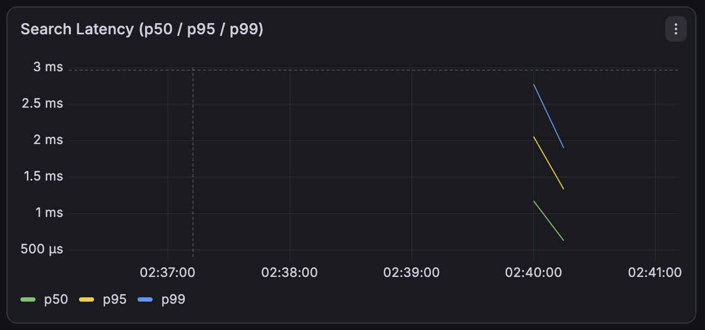

*Latency: 10 одновременных запросов, 20 секунд — после индекса*

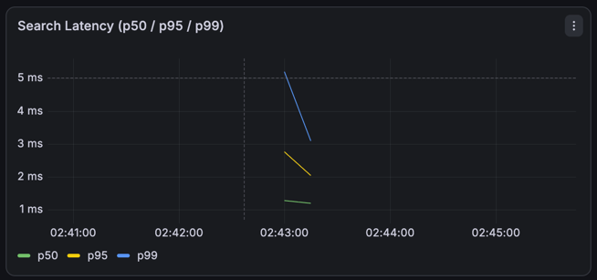

*Latency: 100 одновременных запросов, 20 секунд — после индекса*

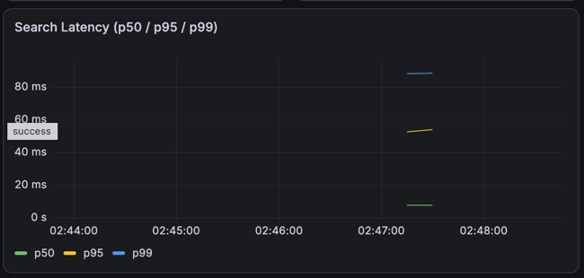

*Latency: 1000 одновременных запросов, 20 секунд — после индекса*

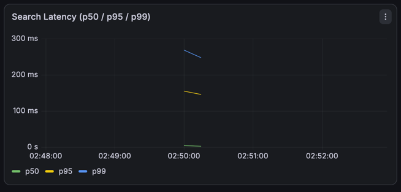

## После индекса: throughput

*Throughput: 1 одновременный запрос, 20 секунд — после индекса*

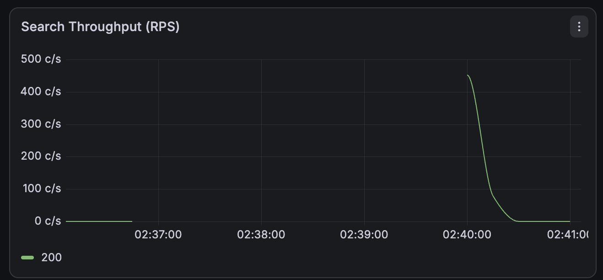

*Throughput: 10 одновременных запросов, 20 секунд — после индекса*

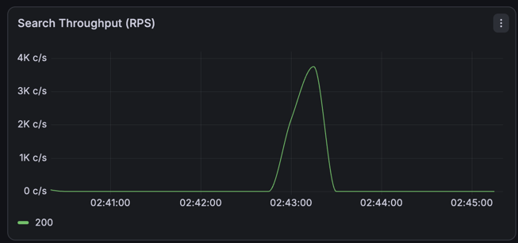

*Throughput: 100 одновременных запросов, 20 секунд — после индекса*

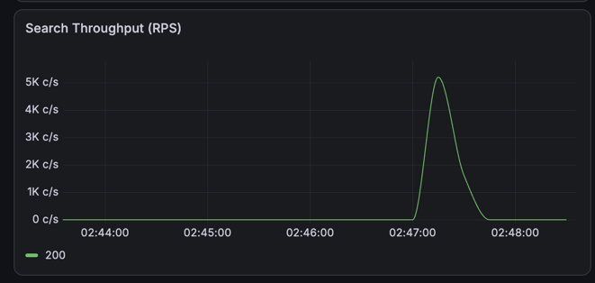

*Throughput: 1000 одновременных запросов, 20 секунд — после индекса*

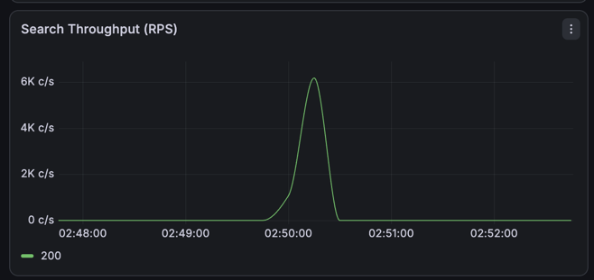

## Тюнинг пула подключений (c=1000, 60 секунд)

Дополнительно расширен HikariCP: pool 10 → 25, `connection-timeout` 5 с, PgJDBC prepared-statement cache (512 запросов / 10 MiB), JVM `-XX:MaxRAMPercentage=60`.

*Latency: 1000 одновременных запросов, 60 секунд — после индекса + пул 25 (Hikari 25, timeout 5s)*

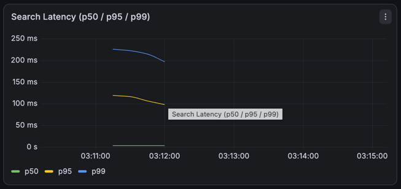

*Throughput: 1000 одновременных запросов, 60 секунд — после индекса + пул 25 (Hikari 25, timeout 5s)*

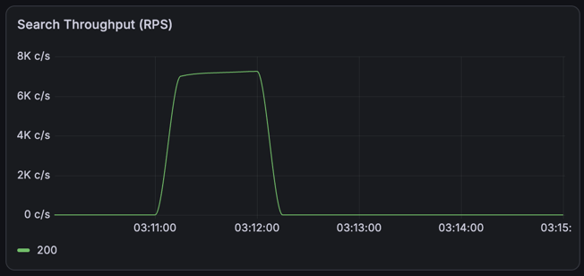

## Сводная таблица до/после

| Уровень | До индекса (pool 10) | После индекса (pool 10) | После индекса + pool 25 |
|---|---|---|---|
| | RPS / p50 / p95 / p99 | RPS / p50 / p95 / p99 | RPS / p50 / p95 / p99 |
| c=1 | 55 / 14 / 21 / 25 мс | 452 / 1 / 2 / 3 мс | — |
| c=10 | 507 / 16 / 27 / 47 мс | 3 754 / 1 / 3 / 5 мс | — |
| c=100 | 518 / 175 / 432 / 647 мс | 5 188 / 8 / 54 / 88 мс | — |
| c=1000 | 552 / 331 / 980 / 1390 мс | 6 186 / 4 / 155 / 268 мс | **7 253 / 4 / 119 / 226 мс** |

**Итог**: индекс убрал лимит соединений БД — пропускная способность выросла **в 8–11 раз** на всех уровнях (до ~7 250 rps), медианная латентность упала **на порядок** (до 1–8 мс), p99 на максимальной нагрузке сократился **в 5–6 раз** (с 1 390 до 226 мс).

---

# ДЗ: Репликация

## Шаг 1. Baseline: нагрузочное тестирование чтения до репликации

### Методика

- **Запросы**: `GET /user/get/{id}` и `GET /user/search?first_name=Ал&last_name=См`.
- **Инструмент**: JMeter 5.6.3, план `user_reads.jmx`.
- **Уровни**: c = 1 / 10 / 100 / 1000 одновременных запросов; 20 сек/уровень (60 с для c=1000).
- **Стенд**: PostgreSQL 16 (Docker), Spring Boot 4.1, 10 ядер, VM 12 GB. База ~1M анкет, индекс `users_search_idx`.
- **Метрики**: RPS, p50/p95/p99 per label; суммарный RPS = search + get.

### Результаты (до репликации, единый PostgreSQL)

| Уровень | search RPS | get RPS | Суммарно | search p50/p95/p99 | get p50/p95/p99 | Ошибки |
|---|---|---|---|---|---|---|
| c=1 | 395 | 395 | 789 | 2 / 2 / 3 мс | 1 / 1 / 2 мс | 0 |
| c=10 | 2 367 | 2 367 | 4 733 | 2 / 4 / 7 мс | 1 / 3 / 5 мс | 0 |
| c=100 | 3 244 | 3 241 | 6 484 | 13 / 38 / 62 мс | 11 / 35 / 59 мс | 0 |
| c=1000 | 4 502 | 4 493 | 8 995 | 93 / 210 / 320 мс | 91 / 207 / 293 мс | 0 |

**Вывод (baseline)**: на одиночном PostgreSQL сервис держит **~9 000 rps** на чтении (суммарно по двум эндпоинтам) при c=1000 без единой ошибки; слейвы пока отсутствуют — вся нагрузка идёт на единственный инстанс. Эти цифры — база для сравнения после перевода чтения на реплики.

## Шаг 2. Инфраструктура: 1 мастер + 2 слейва (потоковая репликация)

### Топология

| Сервис | Порт | Роль | Данные |
|---|---|---|---|
| `postgres-master` | 5432 | primary (запись) | volume `pg_master_data` |
| `postgres-slave-1` | 5433 | standby (чтение) | volume `pg_slave1_data` |
| `postgres-slave-2` | 5434 | standby (чтение) | volume `pg_slave2_data` |
| `postgres_exporter` / `_slave1` / `_slave2` | 9187/9188/9189 | метрики PG | — |

### Конфигурация

- **Мастер**: `wal_level=replica`, `max_wal_senders=10`, `max_replication_slots=10`, `wal_keep_size=1024`, `hot_standby=on`; инициализация роли `replica` через `init.sql` и настройка HBA для localhost репликации.
- **Слейвы**: автоматическая инициализация через `pg_basebackup`, создание `standby.signal` и настройка `primary_conninfo`; старт как `hot standby`.
- **Приложение**: подключение к `postgres-master:5432`; Liquibase привязан к мастеру.
- **Мониторинг**: exporter на каждый узел (master, slave1, slave2).

### Проверка репликации

```
postgres-master: SELECT application_name, state, sync_state FROM pg_stat_replication;
  pg_slave_1 | streaming | async
  pg_slave_2 | streaming | async

postgres-slave-N: SELECT pg_is_in_recovery(), pg_last_wal_receive_lsn() = pg_last_wal_replay_lsn();
  t | t   (режим standby, WAL догнан)

count(*) FROM users: master = slave1 = slave2 = 998 949
```

Live-проверка: `POST /user/register` → строка появляется на обоих слейвах за <2 с. Репликация асинхронная (`sync_state=async`) — синхронный кворум включим позже для эксперимента с потерями.

## Шаг 3. Роутинг: чтение на слейвы, запись на мастер

### Реализация

- Кастомный `AbstractRoutingDataSource` (`ReplicationRoutingDataSource.kt`): определяет источник по флагу `isCurrentTransactionReadOnly`; слейв выбирается round-robin **парами** (`counter/2 % count`) — оба чтения (token-lookup + запрос) попадают на один узел, а запросы чередуются между слейвами.
- Three independent HikariCP-пула: `masterDataSource`, `slaveDataSource(url)`, и `clientDataSource` как `LazyConnectionDataSourceProxy` + `@Primary`. Прокси обязателен: флаг `readOnly` выставляется транзакцией позже, чем получена connection, без proxy роутер всегда выбирал бы мастер.
- `@Transactional(readOnly = true)` на всех читателях: `UserService.getById/search/validatePassword`, `TokenService.resolveUserId`, `UserRepository.count` / `SessionRepository.count`. Записывающие методы — обычный `@Transactional`.
- `application.yml`: `spring.datasource.*` удалён; Liquibase привязан к мастеру.

### Проверка роутинга (эмпирически, pg_stat_statements по узлам)

После `register → login → 50× (search + get)` и сброса `pg_stat_statements` на слейвах:

```
postgres-master:  INSERT INTO users / sessions               ← только записи
                  (SELECT COUNT(*): только Liquibase databasechangelog)

postgres-slave-1: SELECT ... FROM sessions WHERE token=$1    49
                  SELECT ... FROM users WHERE second_name LIKE... 47
postgres-slave-2: SELECT ... FROM sessions WHERE token=$1    51
                  SELECT ... FROM users WHERE second_name LIKE... 52
```

gauge-счётчики (после правки count()): slave-1 считает sessions, slave-2 — users;
на мастере счётчики SELECT COUNT(*) перестали расти.

Вывод: чтение не покидает слейвы (два слейва делят read-нагрузку поровну), на мастер попадают только INSERT/UPDATE/DELETE и Liquibase.

### Запуск в Docker

Окружение в `docker-compose.yml` для сервиса `app` использует имена-хостнеймы контейнеров (`postgres-master:5432`, `postgres-slave-1/2:5432`) — переменные `APP_DATASOURCE_*` и `SPRING_LIQUIBASE_*` без префикса `spring.` у кастомного свойства `app.datasource.*` (иначе Spring не свяжет env-переменные и приложение из контейнера будет ходить на `localhost:5432`). Healthcheck — TCP-проба через `/dev/tcp` (`curl` в образе `eclipse-temurin:25-jre` отсутствует).

## Шаг 4. Load test после репликации (чтение ушло на слейвы)

Тот же план JMeter (`user_reads.jmx`), те же уровни c=1/10/100/1000. Пул слейвов 25 (на c=1000 дополнительно проверены пулы 100 — результат не изменился, см. ниже), мастер — 25.

| Уровень | search RPS | get RPS | Суммарно | search p50/p95/p99 | get p50/p95/p99 | Ошибки |
|---|---|---|---|---|---|---|
| c=1 | 230 | 230 | 460 | 2 / 4 / 5 мс | 1 / 3 / 4 мс | 0 |
| c=10 | 1 903 | 1 903 | 3 806 | 3 / 4 / 6 мс | 2 / 3 / 4 мс | 0 |
| c=100 | 2 886 | 2 886 | 5 772 | 13 / 36 / 53 мс | 11 / 32 / 49 мс | 0 |
| c=1000 | 2 843 | 2 843 | 5 686 | 145 / 261 / 338 мс | 141 / 259 / 336 мс | 0 |

### Что показывает сравнение с baseline (Шаг 1)

- На малых уровнях (c=1..100) суммарный RPS ниже baseline на 10–40 %. Причина — накладные расходы маршрутизации: каждый запрос теперь выполняет **две** транзакции чтения (token-lookup + сам запрос) с BEGIN/COMMIT; при едином пуле в baseline те же два запроса шли с autocommit.
- На c=1000 суммарный RPS **ниже baseline (5 686 vs 8 921)**. Это при том, что каждый слейв отвечает за ~половину нагрузки. Анализ узкого места по метрикам во время прогона:
  - `hikaricp_connections_pending≈0`, `active≈49/100` — пулы подключений не исчерпаны;
  - CPU во время прогона: **app ≈ 450–500 %** (5 ядер), **postgres-slave-1 ≈ 300–500 %**, **postgres-slave-2 ≈ 300 %** → суммарно > 10 ядер Docker Desktop VM;
  - среднее время исполнения SQL на слейвах — 0.01–0.94 мс (по `pg_stat_statements`): сами запросы не медленные.
- Контрольный эксперимент: при отключённом роутинге на 2-й слейв (оба пула → один слейв, код через один и тот же app) — 4 136 rps при 100 % CPU узла (**слейв ~500 % + app ~500 %**). Т.е. один standby обслуживает ~4 тыс. rps, два — ~5.7 тыс., и в обоих случаях стенд упирается в CPU VM, а не в PostgreSQL.

**Вывод по нагруженному стенду**: репликация разнесла чтение по узлам (мастер разгружен — на нём только INSERT/UPDATE/прочее ~0 % CPU при read-нагрузке), но поскольку стенд является CPU-bound (Docker Desktop с 10 vCPU: JVM-приложение + 2 standby + мониторинг), суммарный потолок RPS на этом железе ниже, чем у одиночного сервера в baseline. На реальном стенде (отдельные хосты/машины) выигрыш будет проявляться по мере масштабирования read-нагрузки; здесь же зафиксирован предел стенда.

## Шаг 5. Эксперимент с потерями транзакций: async vs sync quorum

Методика: на мастере коммитим транзакции, затем `docker kill --signal=KILL` мастера (жесткий сбой без flush/stop) и смотрим, какие коммиты видны на слейвах — именно они были бы потеряны при failover (посмертное поднятие мастера для восстановления стенда к потерям не относится).

### Async (исходное состояние)

Стоп слейва + 3 коммита на мастере + убийство мастера → **3 потери из 3** при промоушене слейва (WAL остался только на упавшем мастере).

### Sync quorum (ANY 2)

`ALTER SYSTEM SET synchronous_standby_names = 'ANY 2 (pg_slave_1, pg_slave_2)'` + рестарт мастера. 3 коммита с аck обоим слейвам (latency 130–145 мс). Убийство мастера → **0 потерь**, оба слейва содержат все коммиты, любой можно промоутить.

### Поведение при недоступности кворума

Синхронная репликация «ANY 2»: если один слейв выключен, мастер блокирует запись >5 сек, ожидая ack недоступного участника. После возврата слейва отложенный коммит завершается.

### Состояние после эксперимента

`ALTER SYSTEM SET synchronous_standby_names=''` + рестарт → replication снова **async** (рабочая конфигурация); слейвы догнали WAL, счётчики сходятся; приложение healthy.
